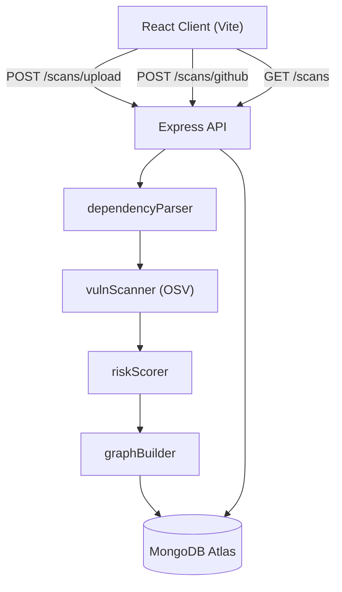

# 🛡️ SecureFlow

> **Intelligent dependency vulnerability dashboard for Node.js projects.**

<p align="center">
  
  
  
  
  
</p>

---

## ✨ Features

- 📦 **File Upload scan** — drop your `package.json` + `package-lock.json`
- 🐙 **GitHub scan** — paste any public repo URL, scan in seconds
- 📊 **Risk score** — weighted 0-100 score based on severity distribution
- 🕸️ **D3 dependency graph** — interactive force-directed graph with zoom/pan
- 🔍 **Vulnerability detail panel** — click a node to see CVEs, CVSS, advisories
- 📜 **Scan history** — paginated table with sort, relative timestamps
- 📄 **PDF export** — two-page report with risk summary + graph screenshot
- 🎨 **Framer Motion** — staggered animations, page transitions, hover states
- 📱 **Responsive** — works on desktop (1440px+), tablet (1024px), mobile (768px)

---

## 🧰 Tech Stack

| Layer      | Technologies                                               |
|------------|------------------------------------------------------------|
| Frontend   | React 18, Vite 6, React Router 6, Framer Motion, D3.js    |
| Charts     | Recharts, custom D3 force graph                            |
| HTTP       | Axios                                                      |
| PDF        | jsPDF + html2canvas                                        |
| Backend    | Node.js, Express 4                                         |
| Database   | MongoDB Atlas + Mongoose                                   |
| Vuln data  | [OSV.dev](https://osv.dev) public API                      |
| File parse | Multer (multipart upload)                                  |
| Security   | Helmet, CORS                                               |

---

## 🚀 Quick Start

### Prerequisites

- Node.js ≥ 18
- A [MongoDB Atlas](https://cloud.mongodb.com) free cluster (or local MongoDB)

### 1. Clone

```bash
git clone https://github.com/Jarvis764/secureFlow.git
cd secureFlow
```

### 2. Install dependencies

```bash
# Backend
cd server && npm install

# Frontend
cd ../client && npm install
```

### 3. Configure environment variables

```bash
# In the server/ directory
cp ../.env.example server/.env
```

Edit `server/.env`:

```env
MONGODB_URI=mongodb+srv://<user>:<password>@cluster.mongodb.net/secureflow
PORT=5000
```

### 4. Run in development

```bash
# Terminal 1 — backend (auto-reload)
cd server && npm run dev

# Terminal 2 — frontend (HMR)
cd client && npm run dev
```

- Frontend: `http://localhost:5173`
- Backend API: `http://localhost:5000/api`

---

## 📡 API Reference

| Method | Endpoint              | Description                              |
|--------|-----------------------|------------------------------------------|
| POST   | `/api/scans/upload`   | Upload `packageJson` + `lockfile` files  |
| POST   | `/api/scans/github`   | Scan a GitHub repo `{ repoUrl }`         |
| GET    | `/api/scans`          | List scans `?page=1&limit=10`            |
| GET    | `/api/scans/:id`      | Get full scan details + graph data       |

All responses are JSON. Error responses include an `error` string field.

---

## 🏗️ Architecture



---

## 📁 Folder Structure

```
secureFlow/
├── client/                 # React + Vite frontend
│   └── src/
│       ├── components/     # Reusable UI components
│       ├── pages/          # Route-level page components
│       ├── services/       # API layer (axios)
│       ├── hooks/          # Custom React hooks
│       ├── utils/          # Formatters & helpers
│       └── styles/         # Global CSS theme
├── server/                 # Express + MongoDB backend
│   ├── config/             # DB connection
│   ├── middleware/         # Error handler
│   ├── models/             # Mongoose schemas
│   ├── routes/             # Express routers
│   └── services/           # Business logic pipeline
└── .env.example            # Environment variable template
```

---

## ☁️ Deployment

### Option A — Railway (backend) + Vercel (frontend)

#### Backend on Railway

1. Create a new project at [railway.app](https://railway.app)
2. Connect this GitHub repo and select the `server/` directory as the root, **or** set the start command:
   ```
   cd server && node server.js
   ```
3. Set environment variables in the Railway dashboard:
   ```
   MONGODB_URI=<your Atlas connection string>
   PORT=5000
   ```
4. Railway auto-deploys on push to main. Note the generated URL (e.g. `https://secureflow-production.up.railway.app`).

#### Frontend on Vercel

1. Import the repo at [vercel.com/new](https://vercel.com/new)
2. Set **Root Directory** to `client`
3. Add environment variable:
   ```
   VITE_API_URL=https://secureflow-production.up.railway.app
   ```
4. Vercel auto-detects Vite. Build command: `npm run build`, Output: `dist`
5. Update `client/vite.config.js` proxy (for production the frontend calls `VITE_API_URL` directly via axios baseURL):

   In `client/src/services/api.js`, the `baseURL` can be set to:
   ```js
   baseURL: import.meta.env.VITE_API_URL ? `${import.meta.env.VITE_API_URL}/api` : '/api'
   ```

### Option B — Render (unified)

1. Create a **Web Service** at [render.com](https://render.com)
2. Root directory: repo root
3. Build command:
   ```bash
   cd client && npm install && npm run build && cd ../server && npm install
   ```
4. Start command:
   ```bash
   node server/server.js
   ```
5. In `server/server.js`, serve the Vite build as static files:
   ```js
   import { fileURLToPath } from 'url';
   import path from 'path';
   const __dirname = path.dirname(fileURLToPath(import.meta.url));
   app.use(express.static(path.join(__dirname, '../client/dist')));
   app.get('*', (_, res) => res.sendFile(path.join(__dirname, '../client/dist/index.html')));
   ```
6. Set environment variable: `MONGODB_URI=<your Atlas connection string>`

---

## 🧪 Testing (manual checklist)

- [ ] `POST /api/scans/github` with `{"repoUrl": "https://github.com/expressjs/express"}` returns `scanId`
- [ ] Dashboard shows latest scan metrics
- [ ] Dependency graph renders with colored nodes
- [ ] Clicking a node opens the vulnerability detail panel
- [ ] History page paginates and sorts correctly
- [ ] PDF export downloads a two-page report
- [ ] Responsive layout works at 768px / 1024px / 1440px

---

## 📄 License

MIT © 2024 SecureFlow contributors

